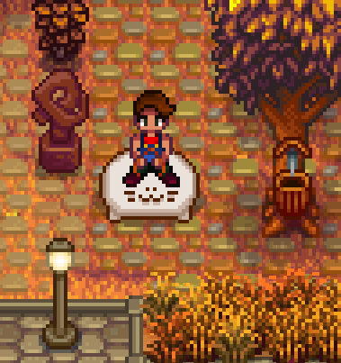
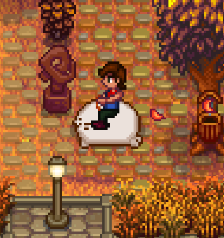

# Stardew Valley chonky seal, horse replacement for Plus_Crazy_4252 at reddit

It was asked in [this Reddit Thread](https://www.reddit.com/r/StardewValley/comments/1jnxub0/this_has_been_haunting_me_for_3_years_since_may/)

1. install smapi and contentpatcher first
2. take the "[CP] Replace Horse" (or download the release zip and unpack) and put the directory in your [Stardew Valley Mods directory](https://stardewvalleywiki.com/Modding:Player_Guide/Getting_Started#Find_your_game_folder)

| Front             | Side            |
|-------------------|-----------------|
|||

## Sources and Tools
I downloaded the original mod from Nexus Mods https://www.nexusmods.com/stardewvalley/mods/1314 which is an xnb Mod.

Then I converted the horse.xnb to png via https://lybell-art.github.io/xnb-js/

I modified the horse mod found here https://forums.stardewvalley.net/threads/how-to-make-a-mod-to-change-the-standard-horse.4295/ I removed the changed horse head, replaced the horse.png and some metadata. thats it.

